# 🍃AWS로 프로젝트 배포하기

## 📖 목차

- [🚀 배포(Deployment)란?](#여기서-배포란-무엇일까)
- [1단계: AWS EC2 인스턴스 생성](#실습해보기)
    - [리전 선택하기](#리전-선택하기)
    - [보안 그룹 설정하기](#보안-그룹-설정하기)
    - [스토리지 구성하기](#스토리지-구성하기)
    - [인스턴스 시작하기](#인스턴스-시작하기)
- [ 2단계: EC2 인스턴스 원격 접속 (SSH)](#인스턴스-접속하기)
    - [인스턴스를 원격으로 접속해보기](#인스턴스를-원격으로-접속해보기)
- [ 3단계: Ubuntu 서버 초기 설정](#초기-설정하기)
    - [스왑 메모리 설정하기](#스왑-메모리-설정하기)
    - [날짜 변경하기](#날짜-변경하기)
    - [최신 업데이트](#최신-업데이트)
    - [자바 설치하기](#자바-설치하기)
    - [MySQL 설치하기](#mysql-설치하기)
    - [스키마 만들기](#스키마-만들기)
- [ 4단계: HTTPS 적용 (Nginx & Certbot)](#https-설정하기)
    - [DuckDNS로 무료 도메인 발급받기](#duckdns로-무료-도메인-발급받기)
    - [nginx 설치하기](#nginx-설치하기)
    - [Nginx 설정 파일 수정하기](#nginx-설정-파일-수정하기)
    - [cerbot 인증서 발급하기](#cerbot-인증서-발급하기)
- [ 5단계: Spring 프로젝트 배포](#spring-프로젝트-배포해보기)
    - [환경변수 설정하기](#환경변수-설정하기)
    - [스프링 프로젝트 올리기](#스프링-프로젝트-올리기)
    - [스프링 프로젝트 실행하기](#스프링-프로젝트-실행하기)
- [ 7단계: 배포 확인](#포스트맨으로-테스트-해보기)
- [더 알아볼 부분](#더-알아볼-부분)

---

> 🧑‍💻 개발자 A : 이제 기능 구현이 다 끝났어~ **배포**하자! <br>
> 👨‍🔧 개발자 B : ㅠㅠ 드디어..!!

### 여기서 `배포`란 무엇일까? <br>
배포(Deployment)는 쉽게 말해 다른 사용자들이 인터넷을 통해서
사용할 수 있게 만드는 것 말한다. <br>
아무리 좋은 서비스를 만들었을지라도 **사용자가 사용하지 못하면 의미가 없다..**<br>

따라서 어떤 서비스를 완성했을 때 바로 다음 단계는 바로 `배포`이다.

---

### 클라우드 서비스
예전에는 물리적인 서버에 직접 애플리케이션을 배포하는 방식이 일반적이었다.<br>
하지만 이 방식은 서버 유지보수, 확장성, 가용성 측면에서 한계가 있어 현재는 클라우드 기반 서비스가 주류가 되었다.

대표적으로 `AWS`와 `GCP`가 클라우드 시장에서 가장 큰 점유율을 차지하고 있는 서비스이다.

---


최근에 클라우드 시장 양대산맥 중 하나인 `AWS` 미국 리전 중 하나가 장애를 일으켜,<br>
전 세계 주요 서비스들이 동시에 먹통이 된 사건도 있었다.<br>

전 세계 서비스 중 약 3분의 1이 `AWS` 기반으로 구동된다는 점을 고려하면,<br>
클라우드 시장에서 `AWS`의 영향력이 얼마나 큰지 알 수 있다.

우리는 `Google Developer Group`의 일원으로 `GCP`를 사용해도 되지만,<br>
클라우드 점유율 1위인 `AWS`를 직접 사용해보는 경험이 더 도움이 될 것이라 판단하였기 때문에<br>
이번 스터디에서는 `AWS EC2 인스턴스`를 생성하는 과정을 통해 배포를 배워볼 것이다.

---

### 그래서 EC2가 뭔데요..
`EC2`는 쉽게 말하면 ‘하나의 컴퓨터(서버)’다.

서버를 배포하려면 24시간 돌아가는 컴퓨터가 필요한데,<br>
내 개인 컴퓨터를 그대로 사용하면 보안 문제도 있고 끊김 없는 서비스를 운영하기도 어렵다.

그래서 우리는 `AWS EC2`를 이용해서 클라우드의 컴퓨터(서버)를 빌려서 배포해볼 것이다.

---

## 실습해보기

### 로그인
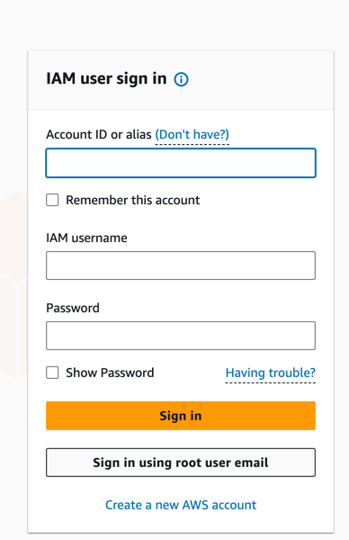

`AWS`에 `root` 유저로 로그인할 것이다.

`Sign in using root user email` 클릭하여 AWS 계정으로 로그인해주자.

### 리전 선택하기

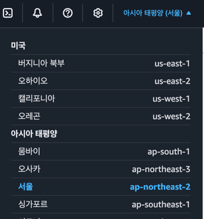

리전을 `아시아 태평양 서울`로 선택한다.

### 리전이란?<br>
> 리전은 인프라를 지리적으로 나누어 배포한 각각의 데이터 센터를 의미한다.<br>
> AWS는 전 세계적으로 다양한 Region을 보유하고 있는데,<br>
> 우리는 주로 한국 유저들이 사용하는 서비스를 만들거라 가정하고 리전을 `아시아 태평양(서울)`로 선택하면 된다.

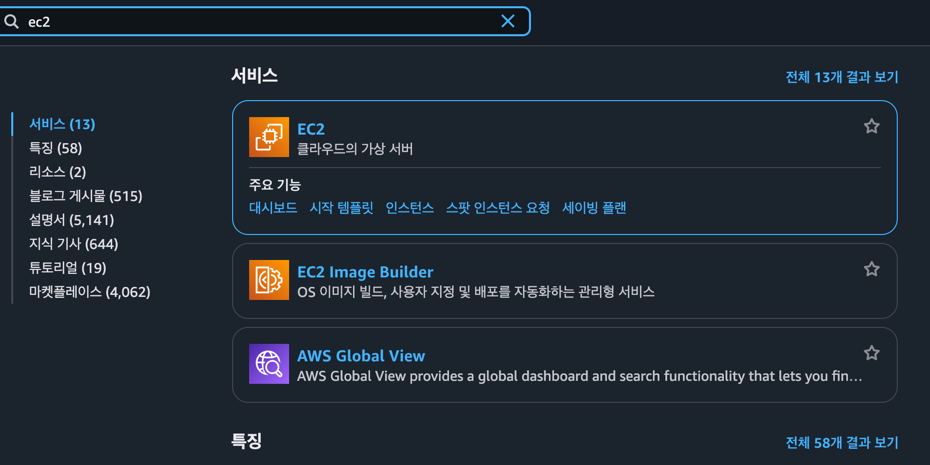

콘솔 창에 `EC2` 검색해 들어간다.

---

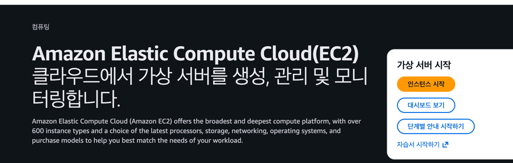

인스턴스 시작 누르기

---

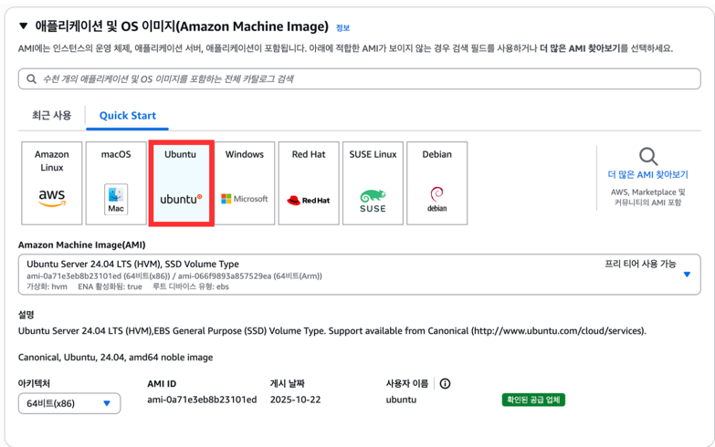

여기서 `Ubuntu` 선택하고 그대로 최신 버전을 사용한다.

---

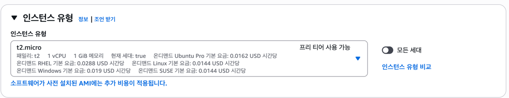

컴퓨터 사양이 좋으면 많은 요청을 처리하거나 무거운 프로그램일수록 유리하다! <br>
우리는 무료인 프리티어 `t2.micro`로 실습할 것 이다.

---

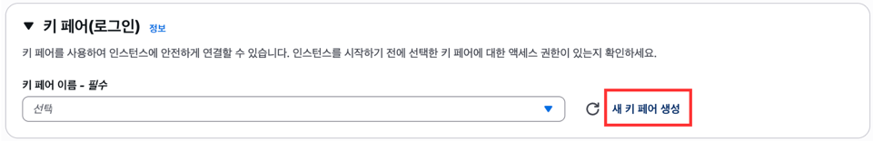

여기서 키 페어를 생성해주자

---
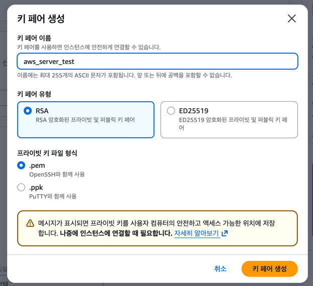

키 페어 이름 입력하고<br>
윈도우 환경은 -> `.ppk`
맥 환경은 -> `.pem` 선택하고<br>
`키 페어 생성` 클릭하여 잘 저장해두자(이따 쓸것임!!)


---
### 보안 그룹 설정하기


> 여기서 `VPC`를 설정해줘도 되지만 `AWS` 입문에서는 일단 넘어가도 크게 문제없으니<br>
> 나중에 `AWS`가 익숙해졌을떄 학습해봤으면 좋겠어요!


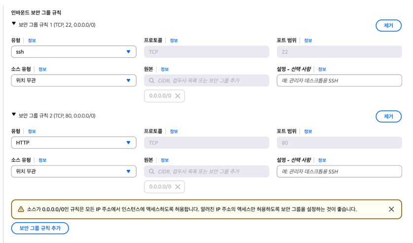

여기서 보안그룹 편집버튼을 눌러 위처럼 `22번 포트`와 `80번 포트`에 대한 인바운드 규칙을 추가하고 위치무관으로 설정하자

- ##### 왜 이 두가지를 추가하죠?
  - 22포트는 우리가 EC2에 원격 접속할 때 사용하는 포트,
  - 80번 포트는 배포한 서버에 기본 HTTP로 접속할 때 사용하기 때문이다!
  - 또 어떤 IP든 전부 접근할 수 있게 소스 유형은 위치 무관으로 설정한다.

---

### 스토리지 구성하기
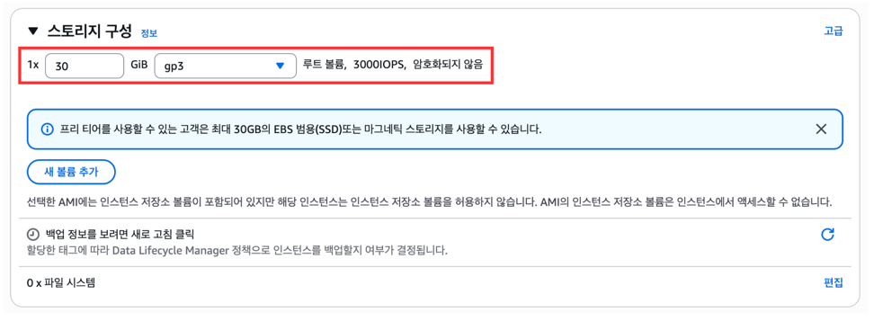

`EC2`도 하나의 컴퓨터다 보니 저장할 공간이 필요하다.
그래서 스토리지에서 가성비 좋은 `gp3`를 선택하고,<br>
프리티어에서는 최대 `30GIB`까지 제공해주기 때문에 설정해주자

---
### 인스턴스 시작하기
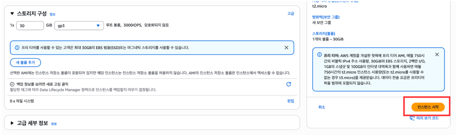

고급 세부 정보는 따로 건들지 말고 `인스턴스 시작`을 눌러주자

---

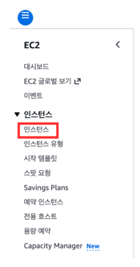

왼쪽 메뉴바를 클릭해서 우리가 만든 인스턴스로 들어가보자

---


우리가 만들어둔 인스턴스가 보인다.
여기서 빨간 박스 속 인스턴스를 클릭하면 <br>
인스턴스의 상세 정보들을 확인해볼 수 있다.

---
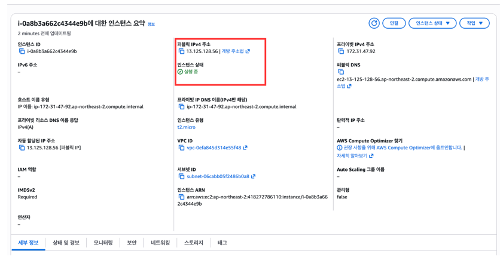

여기서 퍼블릭 `IPv4` 주소는 `EC2 인스턴스가 생성되면서 부여받은 IP 주소`이다<br>
인스턴스 상태가 실행중이면 컴퓨터가 커져있다는 뜻이다.

--- 
### 보안그룹 확인하기
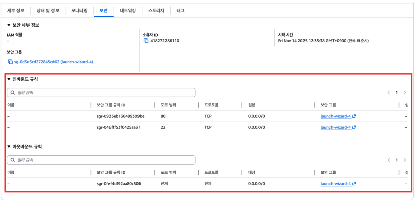

우리가 인스턴스 생성 할떄 설정한 보안 그룸 정보가 나온다.

> 앗!!!!!!
>근데 `Nginx`가 스프링 서버와 통신할 8080 포트랑,
HTTPS 접속에 필요한 443 포트를 깜빡했다..! <br>
> 그럼 어렵게 만든 인스턴스를 지우고 다시 재설정을 해줘야 할까..?<br>
> 
>✨ 참고로 `Nginx`는 이따 배우니 지금은 넘어가자

당연히 인스턴스를 지우지 않고도 보안그룹 편집을 할수 있다!

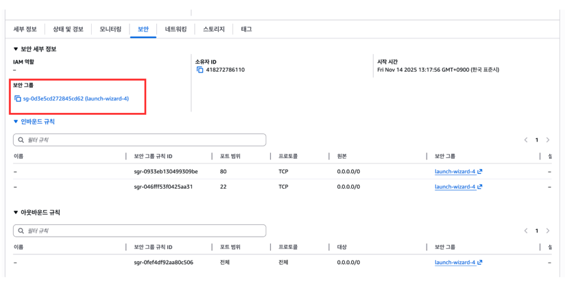

`보안 그룹` 항목에 보이는 `파란색 링크`를 클릭해서 설정 화면으로 들어가자!

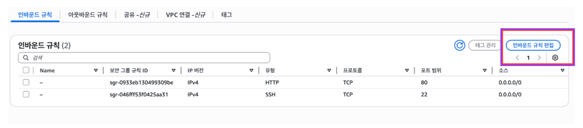

여기서 `인바운드 규칙 편집`을 누른다.

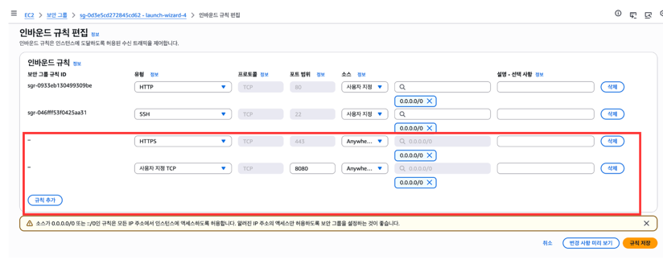

여기서 `443 포트`와 `8080 포트`를 위 그림처럼 추가해주자

---
### 인스턴스 접속하기

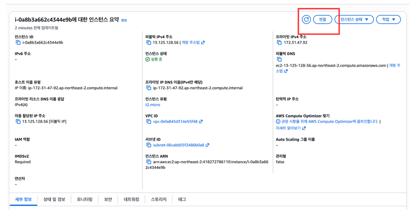

여기서 `연결`을 클릭하자

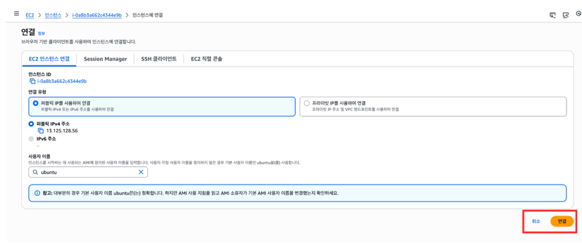

그대로 `연결` 클릭

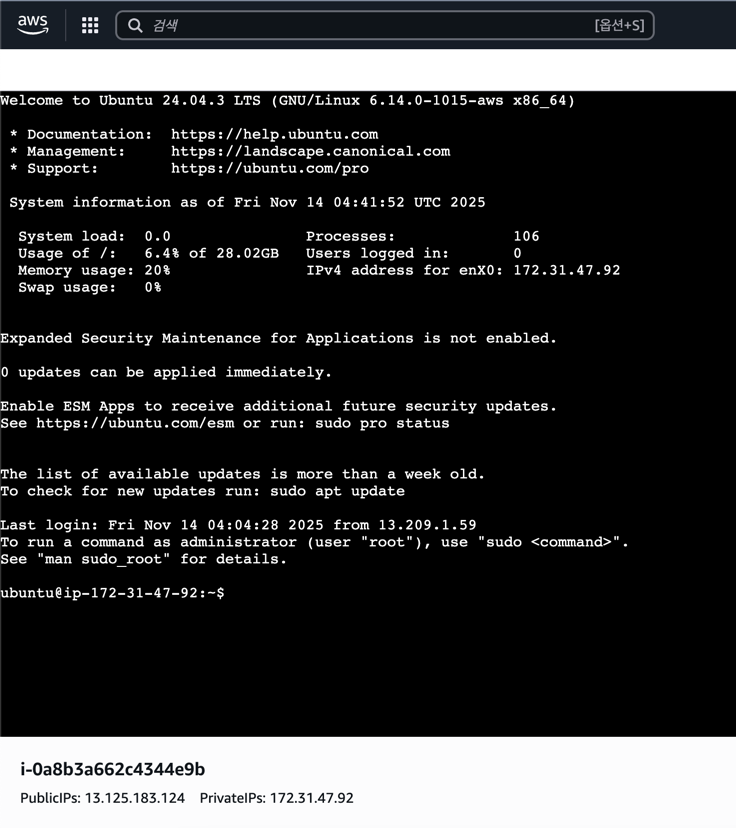

이렇게 화면이 뜬다면 정상적으로 접속이 된 것이다! <br>
근데 매번 이렇게 인스턴스를 접속해 설정한다는 것은 상당히 귀찮은 일이다

그래서 우리가 아까만든 `key pair`를 활용해 
우리 노트북에서도 클라우드 컴퓨터를 원격으로 접속해보자

---

### 인스턴스를 원격으로 접속해보기

> 저는 맥환경이라 윈도우 환경은 아래 링크를 참고해주시면 좋겠습니다..<br>
https://mi2mic.tistory.com/241


원격으로 접속해주기 위해서는<br>
내 `퍼플릭 IP주소`와 아까 저장해둔 `pem키`가 필요하다

---


터미널을 열어서 
아까 저장해둔 `pem키`가 있는 폴더로 이동하자

```bash
chmod 400 파일명
```
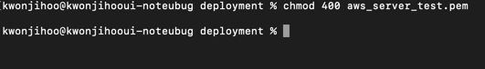

`pem` 키 파일의 보안 권한을 `나만 읽기 가능`으로 설정해주자

---

```bash
ssh -i "본인키파일명.pem" ubuntu@내 퍼블릭 Ip 주소
```
여기서 아까 다운로드한 본인의 `pem` 키 파일 이름과<br>
본인 `EC2` 인스턴스의 퍼블릭 `IP` 주소를 입력한다.

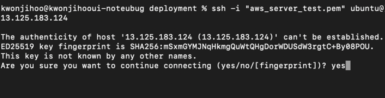

`yes`를 해준다.


---

### 인스턴스 원격 접속 성공
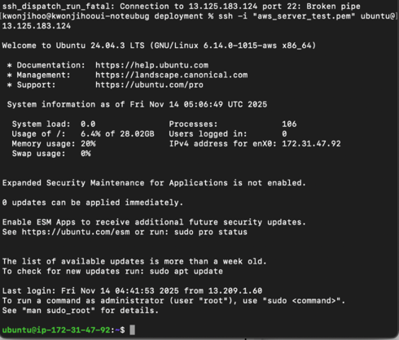

위와 같이 뜬다면 성공적으로 인스턴스에 원격으로 접속한 것이다!

---

## 초기 설정하기

### 스왑 메모리 설정하기
우리가 아까 인스턴스를 만들때 프리티어인 `t2.micro`를 선택했는데,<br>
`t2.micro`의 램이 `1GB`밖에 되지않아 부족할 수 있으므로
스왑 메모리를 설정해주자

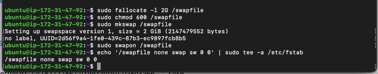

```bash
# 2GB 스왑 파일 생성
sudo fallocate -l 2G /swapfile

# 권한 설정 (보안)
sudo chmod 600 /swapfile

# 스왑 영역 초기화
sudo mkswap /swapfile

# 스왑 활성화
sudo swapon /swapfile

# 재부팅 후 자동 활성화
echo '/swapfile none swap sw 0 0' | sudo tee -a /etc/fstab
```

---

### 날짜 변경하기
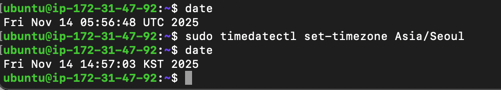

```bash
date // 현재 시간대 확인. 보통 UTC로 설정되어 있음
sudo timedatectl set-timezone Asia/Seoul
date // KST로 바뀐 것을 확인
```

----

### 최신 업데이트

```bash
sudo apt update    # 패키지 목록 업데이트
sudo apt upgrade   # 설치 가능한 패키지 업그레이드
```
인스턴스를 최신으로 업데이트하는 명령어로 최신화를 해준다.

### 자바 설치하기
```bash
sudo apt install openjdk-17-jdk -y #17버전으로 설치
java -version      # 자바 버전 확인
```

### MySQL 설치하기
```bash
sudo apt install mysql-server -y # MySQL 설치
sudo systemctl status mysql # MySQL 서비스 상태 확인
sudo mysql_secure_installation # MySQL 설정
```
`sudo mysql_secure_installation` 설정으로 들어가게 되면
아래와 같이 입력을 해주면 된다.
```bash
Press y|Y for Yes, any other key for No: Y     # root 계정 비밀번호 설정 Y
Please enter 0 = LOW, 1 = MEDIUM and 2 = STRONG: 0  # 비밀번호 복잡도: 낮음 0
Remove anonymous users? : Y                      # 익명 사용자 삭제 Y
Disallow root login remotely? : N                # root 원격 접속 허용 N
Remove test database and access to it? : Y      # test DB 삭제 Y
Reload privilege tables now? : Y                # 권한 테이블 새로고침 Y
```

#### MySQL 비밀번호 설정하기

```bash
sudo mysql
```

`mysql`에 접속한다

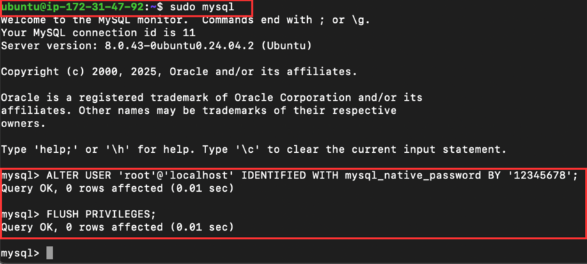

여기서 `Mysql`의 비밀번호를 설정해준다.

```sql
-- root 비밀번호 설정
ALTER USER 'root'@'localhost' IDENTIFIED WITH mysql_native_password BY '12345678';
      
-- 변경 내용 반영
FLUSH PRIVILEGES;
```

---

### 스키마 만들기
```bash
sudo mysql -u root -p # mysql에 접속하기
Enter password: # 이렇게 뜰텐데, 아까 설정한 비밀번호 입력 (타이핑해도 화면에 표시되지 않음!!)
```

`MySQL`에 접속되면 <br> 
 MySQL 프롬프트가 `mysql>` 이런 형식으로 나오면<br>
여기서 스키마를 생성해준다


```sql
create database server_db; # 스키마 생성
SHOW DATABASES; # 생성된 스키마 목록 확인
```
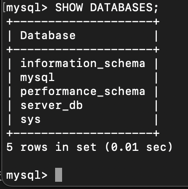

위처럼 표시되면 스키마가 정상적으로 생성된 것이다.

---

## HTTPS 설정하기
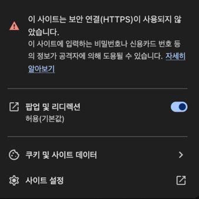

웹페이지에 접속할 때 위처럼 `HTTP` 경고를 본 적이 있을 것이다. <br>
HTTP는 요청과 응답이 암호화되지 않은 상태로 전달되기 때문에,<br>
중간에서 누군가 데이터를 훔쳐보거나 변조할 위험이 있다.

반면에 HTTPS는 TLS(SSL) 암호화를 사용하여 데이터를 안전하게 전송하고,<br>
요청과 응답에 디지털 서명을 하므로 훨씬 안전하다.

이제 우리도 서버에 `HTTPS`를 적용해볼 것이다.

`SSL/TLS` 인증서는 특정 도메인에 대해 발급되기 때문에,<br>
우리는 무료로 도메인을 받을 수 있는 [DuckDNS](https://www.duckdns.org/)를 사용해볼 것이다.

---

### DuckDNS로 무료 도메인 발급받기

먼저 여기에서 본인 소셜 계정으로 `DuckDNS`에 로그인하자.

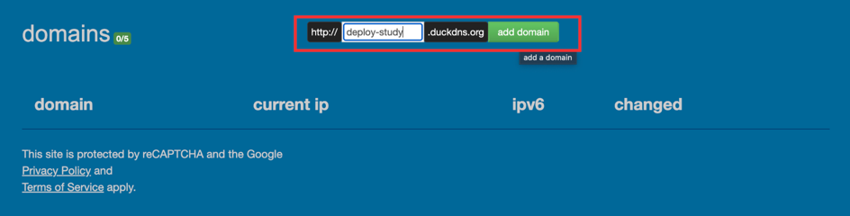

원하는 도메인으로 설정 후 `add domain` 클릭

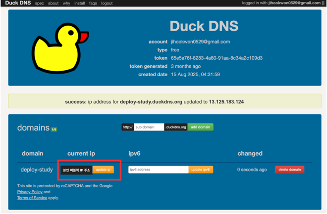

여기서 본인의 인스턴스 퍼블릭 `IP` 주소를 입력 후 `update ip` 클릭

---

### nginx 설치하기

`HTTPS` 설정을 위해 웹 서버인 `Nginx`를 설치해주자
```bash
sudo apt update            # 패키지 목록 업데이트
sudo apt install nginx     # Nginx 설치
sudo systemctl status nginx # Nginx 서비스 상태 확인
```

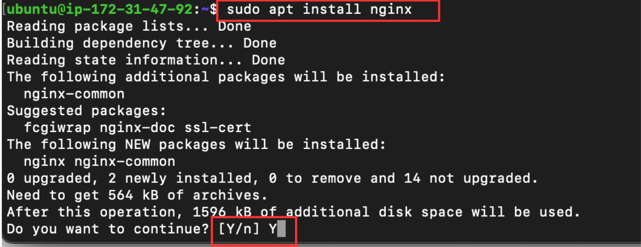

`Do you want to continue? [Y/n]`질문에 `Y` 입력 후 엔터.

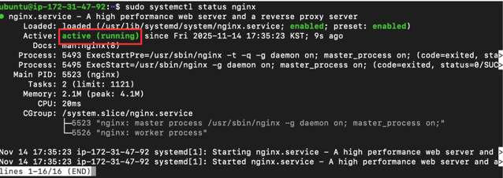

`active`로 표시되면 `Nginx`가 정상적으로 실행 중인 것이다.<br>
`q`를 눌러 상태 화면에서 빠져나오자.

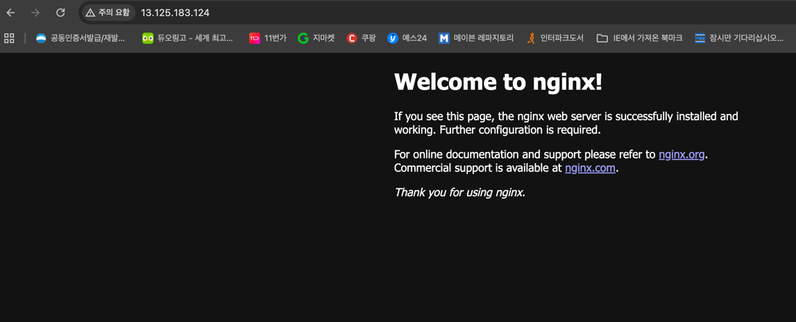

브라우저에서 자신의 퍼블릭 `IP` 주소를 입력하면,<br>
`Nginx`가 정상적으로 실행되고 있음을 확인할 수 있다.

---

### Nginx 설정 파일 수정하기
이제 `Nginx` 설정 파일을 열어 서버 설정을 수정할 것이다.
여기서 vim 명령어를 사용해야 한다. 

#### Vim 기본 명령어 
| 기능             | 명령어    | 설명                        |
| -------------- | ------ | ------------------------- |
| **편집 모드 진입**   | `i`    | Insert 모드로 들어가서 텍스트 입력 가능 |
| **편집 모드 종료**   | `Esc`  | 명령 모드로 돌아가기               |
| **파일 저장**      | `:w`   | 변경 사항 저장                  |
| **저장 후 종료**    | `:wq`  | 저장하고 Vim 종료               |
| **저장하지 않고 종료** | `:q!`  | 저장 없이 강제 종료               |
| **검색**         | `/검색어` | 텍스트 검색                    |

#### 그래서 어떻게 쓰는 건데요..<br>
> 만약 파일을 수정하고 싶다면 `i`를 통해 편집 모드에 들어가서 수정,<br>
> 수정이 다 끝나면 `Esc`를 눌러 명령 모드로 돌아간 후 <br>
`:wq`를 입력하고 엔터하면 저장하고 종료된다.


```bash
sudo vim /etc/nginx/sites-available/default 
```
명령어를 입력하면 아래와 같은 화면이 뜬다.

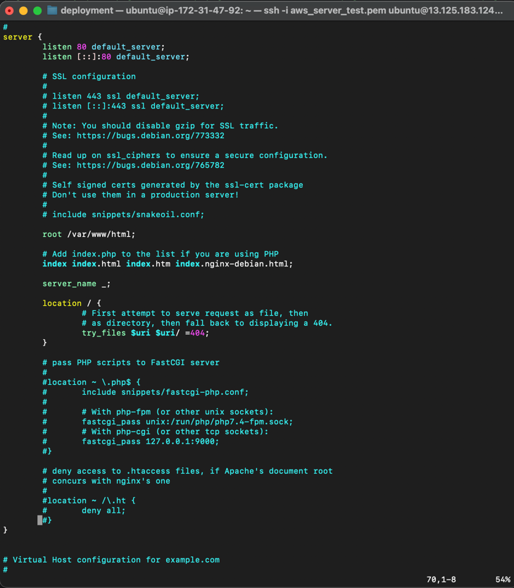

```bash
server_name deploy-study.duckdns.org www.deploy-study.duckdns.org;
```
`DuckDNS`에서 발급받은 도메인 이름을 `Nginx`가 처리하도록 지정하기 위해서<br>
`server_name`에 {구매한 도메인 이름}, www.{구매한 도메인}을 설정해<br>
`www` 포함/미포함 도메인 모두 처리 가능하도록 해주자

```bash
location / {
    proxy_pass http://13.125.183.124:8080;
```

`location` 블록에서는 들어오는 요청을 다른 서버로 전달할 수 있다.<br>
`proxy_pass`에는 실제 애플리케이션 서버가 동작하는 본인 퍼블릭 `IP` 주소와 포트를 설정해야 한다.<br>
여기서 `http://{본인 퍼블릭 IP주소}:8080;`로 설정해주자

```bash
    if ($http_x_forwarded_proto = 'http') {
        return 308 https://$host$request_uri;
    }
}
```
여기서 `HTTP` 요청이 들어오면 `HTTPS`로 리다이렉트해줄 것이다.<br>
`308`은 영구 리다이렉트이라는 뜻으로, 브라우저가 다음에도 자동으로 `HTTPS`로 접속하게 해준다!

#### Nginx 설정파일 최종적으로 수정한 버전

```bash
# 아까 dns에서 발급한 도메인 입력
server_name deploy-study.duckdns.org www.deploy-study.duckdns.org;

location / {
    # '본인 인스턴스 IP 설정
    proxy_pass http://13.125.183.124:8080;
    
    # First attempt to serve request as file, then
    # as directory, then fall back to displaying a 404.
    if ($http_x_forwarded_proto = 'http') {
        return 308 https://$host$request_uri;
    }
}
```
입력이 완료된 화면은 아래와 같다.

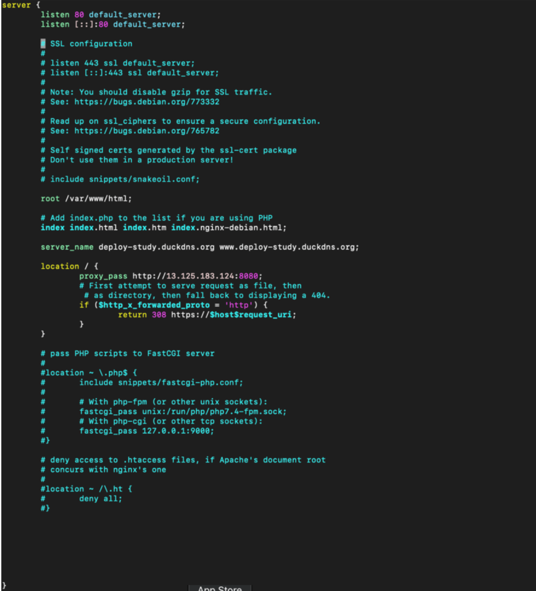

수정이 끝나면 `Esc`를 눌러 명령 모드로 돌아간 후, `:wq`를 입력하고 엔터.

```bash
sudo nginx -t  # Nginx 설정 문법이 맞는지 확인
```
`Nginx`가 문법적으로 오류가 없는 지 확인해준다.

```bash
sudo systemctl daemon-reload # systemd에 변경 사항 반영
sudo systemctl reload nginx # Nginx 설정 다시 불러오기
sudo systemctl status nginx # Nginx 상태 확인
```

이제 `Certbot`을 사용해 `SSL/TLS` 인증서를 발급해야 한다.

#### 잠깐! 왜 인증서를 발급해야 하죠??<br>
> 인증서를 발급하면 Nginx가 HTTPS로 안전하게 통신할 수 있고,<br>
> 웹사이트와 사용자 간의 데이터가 암호화되어 안전하게 전송된다.

---


### cerbot 인증서 발급하기

```bash
# certbot을 설치하기 위해 snap을 먼저 설치
sudo snap install core
sudo snap refresh core

# 기존에 설치된 certbot을 제거
sudo apt-get remove certbot

# certbot 설치한다
sudo snap install --classic certbot

# certbot 명령어가 실행될 수 있게 세팅
sudo ln -s /snap/bin/certbot /usr/bin/certbot

sudo certbot --nginx -d {본인 도메인 이름} www.{본인 도메인 이름}
# 제 명령어는 sudo certbot --nginx -d deploy-study.duckdns.org -d www.deploy-study.duckdns.org

# 아래 명령어로 자동 리뉴얼이 적용되고 있는지 확인할 수 있다
sudo certbot renew --dry-run
```

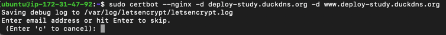

`Enter`로 건너뛸 수 있지만, 인증서 유효기간이 90일로 짧기 때문에 만료 알림을 받으려면 이메일 입력하는 것이 좋다<br>
알림을 받을 본인의 이메일을 입력.


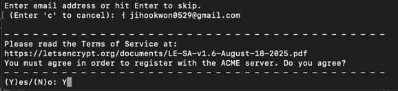

`Y` 입력 후 엔터

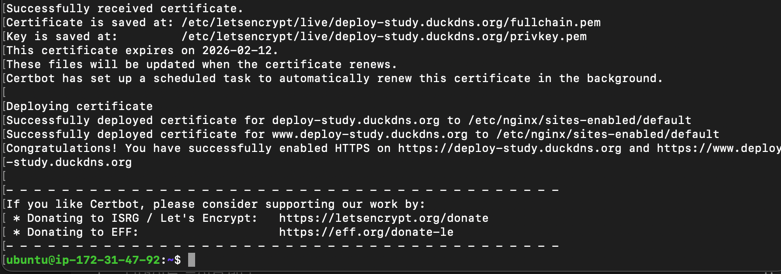

위와 같은 화면이 나오면 인증서 발급 성공이다.

---

## Spring 프로젝트 배포해보기
이제 우리가 만든 `AWS` 인스턴스에 `Spring` 프로젝트를 배포해볼 것이다.

### 환경변수 설정하기
```bash
sudo vim ~/.bashrc
```
로 환경변수를 주입해주자

```bash
export DB_JDBC_URL=jdbc:mysql://127.0.0.1/아까 본인이 만든 스키마 이름
export DB_USER_NAME=root
export DB_PASSWORD=아까 본인이 설정한 mysql비밀번호
```
`i`를 입력해 `insert` 모드로 들어가<br>
맨 마지막 줄에 위 환경변수를 주입.

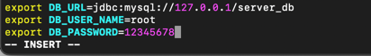

설정한 `.bashrc` 파일은 다음과 같다.<br>
설정이 끝났으면 저장 후(`Esc` 후 `:wq`)<br>
`source ~/.bashrc`입력 후 엔터로 변경사항을 최종적으로 저장한다.

---


### 스프링 프로젝트 올리기
우리는 이전에 `JPA`에서 만든 `JpaExample` 프로젝트를 배포해볼 것 이다.<br>

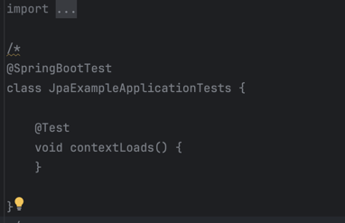

프로젝트의 테스트 환경에는 `yml` 파일이 없으므로, 관련 `Test` 설정 파일을 주석 처리한다.

---

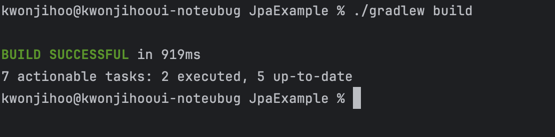

프로젝트에서 상단 메뉴바에 `View -> Tool Windows -> Terminal`로 <br>
터미널 환경에서 `./gradlew build`를 입력해 프로젝트를 빌드한다.

위 화면처럼 빌드가 성공하면, `build/libs` 폴더에 `jar` 파일이 생성된다.

---


```bash
scp -i [본인의 pem키_경로] ./build/libs/[본인 jar파일_이름].jar ubuntu@본인 IP주소:~/
```
이 명령어를 입력하여 로컬 `PC`의 `jar` 파일을 `AWS` 인스턴스로 전송한다.

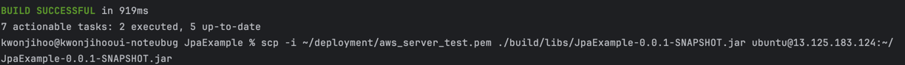

성공했다면 위와 같은 화면이 뜰 것이다.

---

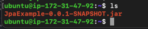

`ls` 명령어를 사용해 인스턴스에 `jar` 파일이 정상적으로 업로드되었는지 확인할 수 있다.


---

### 스프링 프로젝트 실행하기


`java -jar 파일이름.jar`로 `Spring` 프로젝트를 실행해보자<br>
실행이 잘 되는 것을 확인할 수 있다.

하지만 터미널 세션이 종료되면 애플리케이션도 종료될 위험이 있기 때문에 먼저 `Ctrl + C`로 현재 실행을 종료한다.<br>
우리는 `nohup` 명령어를 사용해 터미널 종료 후에도 백그라운드에서 계속 실행되도록 설정해줄 것이다.

---


```bash
nohup java -jar 파일이름.jar &

ps -ef | grep 파일이름.jar # 잘 실행되는 지 확인 명령어
```
를 통해 아래 화면과 같이 뜬다면 `nohup` 설정이 잘된 것이다.

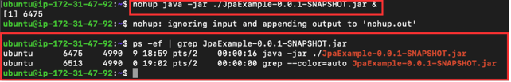

---

### 포스트맨으로 테스트 해보기

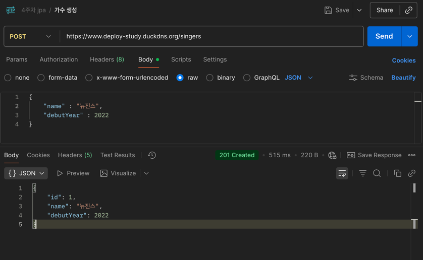

이제 다시 콘솔 창에서 `java -jar ./JpaExample-0.0.1-SNAPSHOT.jar` 로 애플리케이션을 실행시키고<br>
우리가 설정한 도메인으로 요청을 보내보면
잘 응답이 오는 것을 확인할 수 있다.

---

### 더 알아볼 부분
- 배포를 자동화 하는 방법(CI/CD)
- VPC
