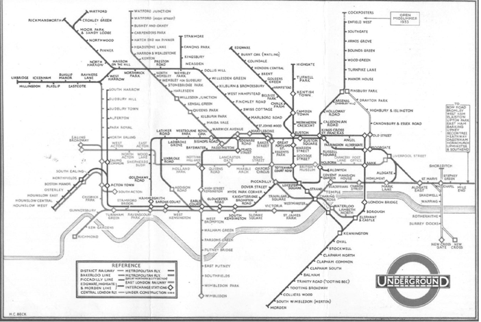

# Chap03 타입과 추상화
> 현상은 복잡하다. 법칙은 단순하다. 버릴 게 무엇인지 알아내라.

1863년 영국 런던에서 세계 최초 지하철이 개통된 지 150여 년의 세월이 더 흐른 지금,  
전 세계 주요 대도시 지하에는 지하철이 거미줄처럼 도시 곳곳을 연결하고 있다.  
복잡한 미로 같은 지하철을 큰 어려움 없이 이용할 수 있는 가장 큰 이유는  
단순하고 직관적인 역 간의 네트워크를 잘 표현하는 지하철 노선도가 있기 때문이다.

  
_해리 백이 처음 고안한 백의 회로도_

1933년에 해리 백이 만든 지하철 노선도는 사실적인 지형과 축적은 무시하고,  
역 사이의 연결성에만 집중한 혁신적 지하철 노선도를 창조했다.

모든 역의 위치와 거리도 부정확한 이 지도는 정확성을 버리고, 목적에 집중했다.  
지하철을 탈 때 지형이나 역의 위치보다 **연결**, 즉 열차를 갈아타는 지점을 잘 표현하는 것이다.  
해리 백의 가장 큰 업적은 이러한 지하철 노선도를 **추상화**한 것이다.

---

## 추상화를 통한 복잡성 극복
현실은 복잡하고, 예측 불가능한 혼돈의 덩어리다.  
더욱 문제는 복잡성의 총제인 현실이라는 괴물을 그대로 수용하기엔 인간이 지니고 있는 인지 능력이  
너무나도 보잘 것 없다는 것이다. 
그렇기에 사람들이 본능적으로 이해하기 쉽고, 예측 가능한 수준으로 현실을 
분해하고 단순화하는 전략이 중요하다.

해리 백의 지하철 노선도는 단순함을 달성한 추상화의 훌륭한 예시이다.
진정한 의미의 추상화는 현실에서 출발하되, 불필요한 부분을 도려내가며,
사물의 놀라운 본질을 드러내는 과정이라 할 수 있다.

그리하여, 객체지향 패러다임은 **객체라는 추상화**를 통해 현실의 복잡성을 극복한다.

## 객체지향과 추상화
이상한 나라의 앨리스로 돌아가보자.  
이 동화에는 수많은 객체들이 등장한다.  
특히 앨리스가 스스로에게 "기껏해야 트럼프에 불과해"라 읊조리는 대사는  
정원에 서 있는 계급, 나이, 성격 등 다양한 인물들의 차이점을 무시하고,  
'트럼프'라는 유사성을 기반으로 추상화해서 바라보고 있는 것이다.

### 그룹으로 나누어 단순화하기
앨리스의 이야기에서 왜 다양한 인물들을 '트럼프'라는 한 단어로 지칭할 수 있었을까?  
그 이유는 '트럼프'라 했을 때 떠오르는 일반적인 외형과 행동 방식을 공통적으로 지녔기 때문이다.  
앨리스는 정원에 있는 인물들을 트럼프와 토끼라는 두 가지 그룹으로 나누어,  
두 개의 렌즈를 통해 정원을 바라보는 것은 정원에 내재된 복잡성을 감소시켰다.

### 개념

앨리스가 인물들의 차이점을 무시하고, 공통점만을 취해 트럼프라는 개념으로 단순화 한 것이  
바로 추상화의 일종이다.  

이렇게 공통점을 기반으로 객체들을 묶기 위한 그릇을 **개념(concept)**이라 한다.  
개념을 이용하면 객체를 여러 그룹으로 분류할 수 있다.

결국 각 객체는 특정한 개념을 표현하는 그룹의 일원으로 포함된다.  
즉 하트여왕은 '트럼프'라는 그룹의 일원이고, 하얀 토끼는 '토끼'라는 그룹의 일원이다.  

이때 객체의 어떤 개념을 적용하는 것이 가능해서, 개념 그룹의 일원이 될 때  
객체를 그 개념의 **인스턴스**라 한다.

### 개념의 세 가지 관점

### 개념의 세 가지 관점

일반적으로 객체의 분류 장치로서 개념을 이야기할 때 아래의 세 가지 관점을 언급한다.

- **심볼(symbol)** : 개념을 가리키는 간략한 이름이나 명칭
- **내연(intension)** : 개념의 완전한 정의를 나타내며, 내면의 의미를 이용해 객체가 개념에 속하는 여부를 확인할 수 있다.
- **외연(extension)** : 개념에 속하는 모든 객체들의 집합(set)

예시:

- '트럼프'라는 이름 → **심볼**
- '몸이 납작하고 두 손과 두 발이 네모난 몸 모서리에 달려 있다' → **내연**
- 정원사, 병사, 신하, 왕자와 공주, 하트 여왕 → **외연**

### 개념을 분류하기 위한 틀
분류는 특정한 객체를 특정한 개념의 객체 집합에 포함시키거나, 포함시키지 않는 작업을 말한다.  
객체를 적절히 분류한 애플리케이션은 유지보수에 능하고, 변경에 용이하게 대처할 수 있을 뿐 아니라  
해리 백의 지하철 노선도처럼 객체를 쉽게 찾고 조작할 수 있는 정신적인 지도를 제공해줄 것이다.

> 분류는 추상화를 위한 도구다.

- 추상화의 첫 번째 차원: 공통점을 취하고 차이점은 버리는 **일반화**
- 두 번째 차원: 중요한 부분을 강조하기 위해 **불필요한 세부 사항 제거**

개념은 객체들의 복잡성을 극복하기 위한 추상화 도구다.  
추상화를 사용함으로써 우리는 극도로 복잡한 세상을  
그나마 제어 가능한 수준으로 단순화할 수 있는 것이다.

---
## 타입
**개념**은 폭넓게 사용되는 일상적 용어지만  
컴퓨터 공학자들은 좀 더 세련된 용어인 타입(type)을 사용한다.

타입의 정의는 개념의 정의와 완전히 동일하지만,  
컴퓨터 내부로 들어오면 좀 더 기계적인 의미로 혼란스럽기도 하다.

### 데이터 타입

타입이 없는 메모리 내부 값은 수많은 오해와 시행착오에 부딪히게 된다.  
예: `10101010`은 문자일까 숫자일까?

그래서 사람들은 숫자형, 문자형 등 데이터의 용도에 따라 분류하기 시작했다.

타입에 관련해 중요한 사실 두 가지:

1. 타입은 **데이터가 어떻게 사용되는지**에 관한 것이다.
2. 타입에 속한 데이터를 **메모리에 어떻게 표현하는지는 외부로부터 감춰진다.**

### 객체와 타입
객체지향 프로그램을 작성할 때 우리는 객체를 일종의 데이터처럼 사용한다.  
하지만 **객체는 데이터가 아니다.** 객체에서 제일 중요한 것은 **객체의 행동이다.**

1. 어떤 객체가 어떤 타입에 속하는지를 결정하는 것은 **객체가 수행하는 행동**이다.
2. 객체의 내부적인 표현은 **외부로부터 철저하게 감춰진다.**

### 행동이 우선이다.
어떠한 객체가 어떤 데이터를 가지고 있는 지는 우리의 관심사가 아니다.  
그 객체가 다른 객체와 동일한 데이터를 가지고 있더라도  
**다른 행동을 한다면 서로 다른 타입으로 분류**되어야 한다.

즉, 객체의 타입을 결정하는 것은 **행동**이다.  
타입이 데이터가 아니라 행동에 의해 결정된다는 사실은  
객체지향 패러다임을 특정 짓는 중요한 원리다.

- 동일한 메시지를 서로 다른 방식으로 처리하기 위해서는 객체들은 동일한 메시지를 수신할 수 있어야 한다.
- 결과적으로 **다형적인 객체들은 동일한 타입에 속하게 된다.**

> 데이터가 객체의 인터페이스를 오염시키는 순간  
> 객체의 분류 체계는 위험에 노출되고 유연하지 못한 설계를 낳는다.

그래서 등장한 것이 **책임-주도-설계(Responsibility-Driven Design)**  
→ 데이터 중심 설계(Data-Driven Design)의 단점을 개선하기 위해 고안되었다.

> 객체를 결정하는 것은 행동이다.  
> 데이터는 단지 행동을 따를 뿐이다.

---

## 타입의 계층

앨리스가 정원사, 병사, 하트여왕을 정말 트럼프라 생각한 것일까?  
정확히 말하자면 이들은 트럼프의 특징을 가진 **트럼프 인간**이다.

- 트럼프 인간은 트럼프가 될 수 있지만,
- 트럼프는 트럼프 인간이 될 수 없다.

따라서 **트럼프는 트럼프 인간을 포괄하는 더 일반적인 개념**이다.  
이 관계를 **일반화/특수화 관계**라 한다.

### 일반화/특수화 관계
- 한 타입이 다른 타입보다 더 특수하게 행동해야 하고
- 반대로 한 타입은 더 일반적으로 행동해야 한다.

앨리스 동화에서 트럼프가 **트럼프 인간의 일반화**인 이유:  
→ 트럼프가 가진 모든 행동을 트럼프 인간이 공통적으로 수행할 수 있기 때문이다.  
→ 즉, 트럼프 인간은 **트럼프의 특수화**다.

정리하자면:

- **일반적인 타입**은 특수한 타입에 비해 더 적은 수의 행동을 가진다.
- **특수한 타입**은 일반적 타입에 비해 더 많은 행동을 가진다.

### 슈퍼타입과 서브타입
일반화/특수화 관계에서 좀 더 일반적인 타입을 슈퍼타입(Supertype), 
좀 더 특수한 타입을 서브타입(subtype)이라 한다.

서브타입은 슈퍼타입의 행위에 추가적으로 특수한 자신만의 행동을 추가하는 것이라 
슈퍼타입의 행동은 서브타입에게 자동으로 상속될 수 있다.

### 일반화는 추상화를 위한 도구다
- 추상화의 두 번째 차원은 중요한 부분을 강조하고 불필요한 세부사항을 제거해 단순하게 만드는 것이다.
- 일반화/특수화 계층은 추상화의 두 번째 차원을 활용한 좋은 예시이다.

#### 《이상한 나라의 앨리스》에서의 추상화 예시

1. 정원의 등장인물들 간 차이점을 제거하고 공통점만 강조하여 **트럼프 인간으로 분류**
2. 트럼프 인간의 불필요한 특성(예: 걸어다니는 능력)을 제거하고 **트럼프 카드로 일반화**

---

## 정적 모델

### 타입의 목적
- 앨리스는 음식 섭취나 행동에 따라 상태는 변하지만 **식별성은 유지**된다.
- 타입은 시간에 따라 동적으로 변하는 객체의 상태를 **시간과 무관한 정적인 모습으로 표현**할 수 있게 해준다.

### 그래서 결국 타입은 추상화다.
타입은 추상화이다. 타입을 이요해서 객체의 동적인 특성을 추상화할 수 있다.  
결국 타입은 시간에 따른 객체의 상태 변경이라는 복잡성을 단순화할 수 있는 효과적 방법이다.

### 동적 모델과 정적 모델
- 객체가 특정 시점에 구체적으로 어떤 상태를 가지느냐 → **동적 모델**
- 객체가 가질 수 있는 모든 상태와 행동을 시간과 무관하게 표현하는 것 → **정적 모델**

→ 객체지향 애플리케이션에서는 이 두 가지 관점을 **혼용**해서 설계하고 구현해야 한다.

### 클래스
타입을 구현하는 가장 보편적인 방법은 클래스를 이용하는 것이다. 
대부분 사람들은 객체지향 패러다임을 주도하는 대부분 프로그래밍 언어는 클래스를
기반으로 하기 때문에   클래스와 타입을 동일한 개념으로 생각한다. 

하지만 타입은 객체를 분류하기 위해 사용하는 개념이고, 
클래스는 타입을 구현할 수 있는 여러 구현 매커니즘 중 하나일 뿐이다.

---
## 🎯 3장의 핵심
객체지향에서 중요한 것은 **동적으로 변하는 객체의 상태**와 **상태를 변경하는 행위**이다.

즉, 객체라는 추상화를 통해  
객체 스스로 **수행할 행동을 결정**하고 **타입을 나누어야 한다.**

