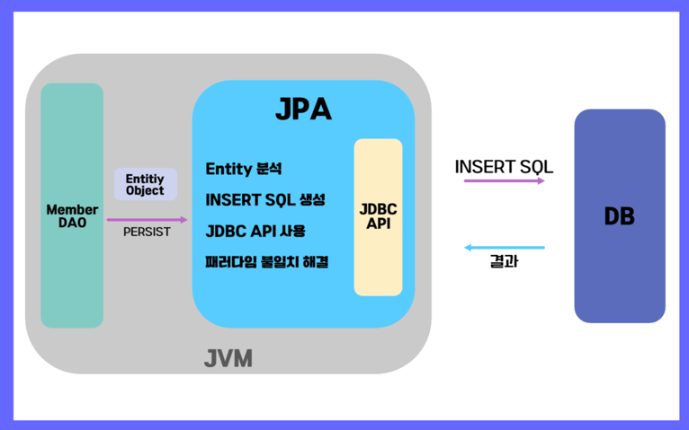
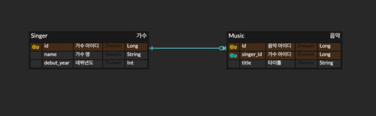
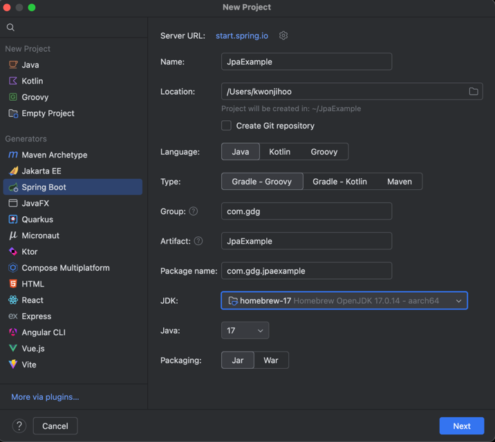
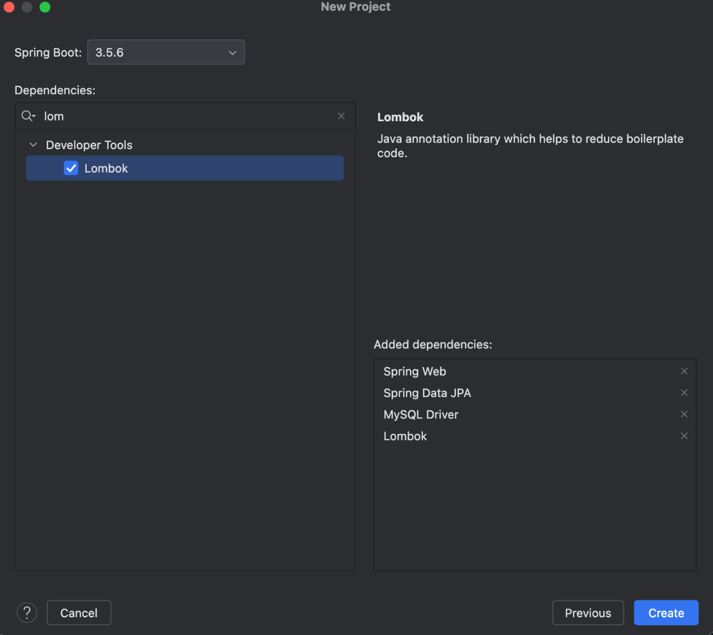
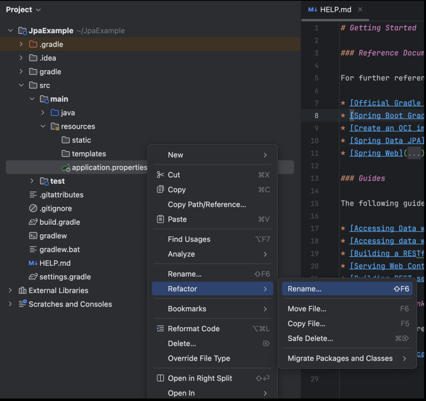
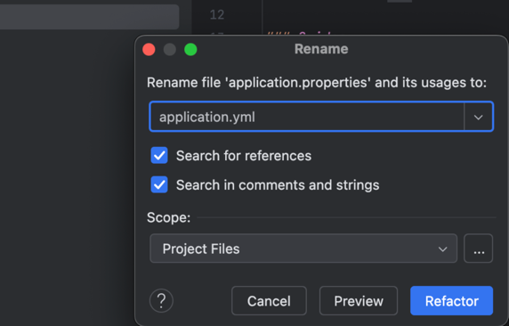
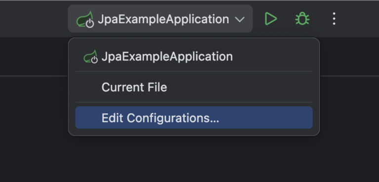
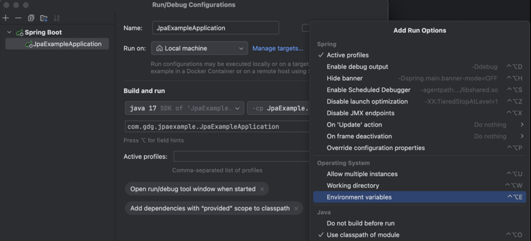
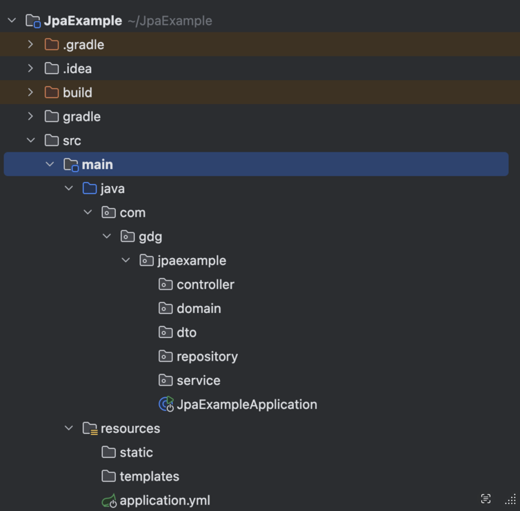
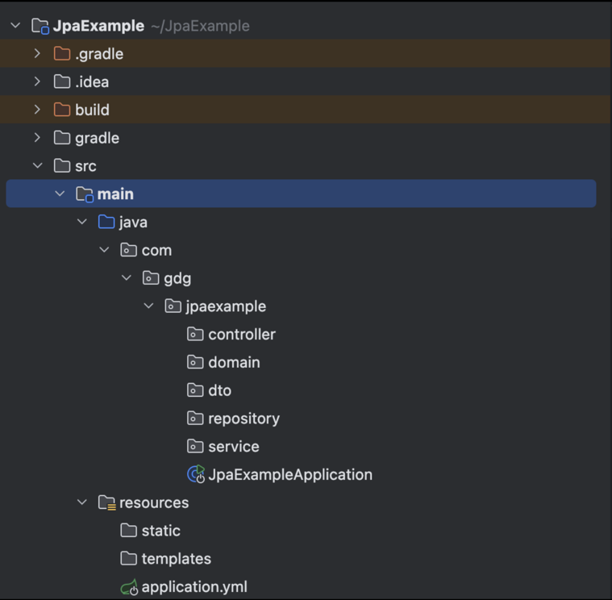

# 🍃[Spring Data JPA]

## 📖 목차

- [JPA란?](#jpa란)
- [왜 JPA를 사용할까?](#왜-jpa를-사용할까)
  - [ORM?](#orm)
  - [JPA의 동작과정](#jpa의-동작과정)
  - [JAVA에서 JPA의 주요 장점](#java에서-jpa의-주요-장점)
- [실습하기!](#실습하기)
  - [프로젝트 세팅](#프로젝트-세팅)
  - [데이터베이스 연결](#데이터베이스-연결)
  - [application.yml](#applicationyml)
  - [환경변수 세팅](#환경변수-세팅)
  - [Domain 만들기](#domain-만들기)
  - [Repository 만들기](#repository-만들기)
  - [DTO 만들기](#dto-만들기)
  - [Service 만들기](#service-만들기)
  - [Controller 만들기](#controller-만들기)
  - [포스트맨으로 테스트하기](#포스트맨으로-테스트하기)

---

우리가 3차시에 배운 [REST API](https://www.notion.so/3-REST-API-276d426076cd8071a0fcd8d02f6be84b#277d426076cd80bca7efc8949bf6bfc1)는 애플리케이션 재실행 시 데이터가 초기화되는 문제가 발생한다.<br>
이로 인해 방금 배운 데이터베이스를 활용해 데이터를 영구적으로 저장하고 유지해야한다.<br>
이때 활용할 것이 바로 **JPA**이다.

# JPA란?
JPA는 Java Persistence API 의 약자로 자바 ORM 기술에 대한 표준 명세이며,<br>
자바에서 제공하는 API이다. 개발자가 객체지향 프로그래밍 언어에서 사용하는 객체 모델과<br>
관계형 데이터 베이스의 테이블 간 매핑을 자동으로 처리해준다.

# 왜 JPA를 사용할까?
본격적으로 JPA를 알아보기 전
우리는 항상 “왜 이 기술을 사용해야 하는가?”를 먼저 생각해볼 필요가 있다.

### 직접 SQL을 다루면 안되는 걸까?
자바 애플리케이션은 JDBC API를 사용해 SQL을 데이터베이스에 전달한다.<br>
즉, 개발자가 직접 SQL문을 작성하고 실행해야 한다.<br>
하지만 이러한 작업은 상당히 고된 일이다…

```sql
# 처음엔 학생의 단순 이름만 출력하는 요구사항이였다!
SELECT name FROM Student;

# 그런데 나이와 이메일도 같이 보여달라는 요청이 들어왔다면?
SELECT name, age, email FROM Student;

# 또 요구사항이 바뀌어 20살 이상인 사람만 보여달라면?
SELECT name, age, email FROM Student WHERE age >= 20;
```
이렇게 요구사항이 바뀔 때마다 JAVA 개발자는 매번 SQL까지 직접 수정해야 한다.<br>
또한 새로운 필드가 생길 때마다 쿼리문을 일일이 수정해야 하는 더 많은 유지보수가 발생한다.

즉, SQL에 의존적인 개발을 피하기가 어려워다는 의미이다.<br>
이러한 상황에서 최선의 선택은 JPA에서 제공하고 있는 ORM이다.

---
## ORM?
**Object-relational Mapping**(객체 관계 매핑)의 약자이다.<br>
ORM을 사용하면 객체와 데이터베이스 테이블 간 변환을 자동화할 수 있다.

즉, 데이터베이스의 행(Row)을 객체로 매핑하고, 객체의 속성을 데이터베이스의 열(Column)과 연결한다.<br>
이를 통해 개발자는 JPA를 활용하면 객체와 관계형 데이터 베이스 간 맵핑을 손쉽게 처리할 수 있으며,<br>
데이터베이스의 `CRUD(Create, Read, Update, Delete)` 작업을 간편하게 수행할 수 있다.


## JPA의 동작과정
<!-- {"width":798} -->

JPA를 활용하면 ORM 내부적으로 java 메서드에 적합한 SQL문이 자동으로 생성되어 실행된다.<br>
그럼 자바 개발자는 클래스만 만들어서 사용하고 직접적으로 SQL문을 작업할 번거로움이 없어지게 된다.

## JAVA에서 JPA의 주요 장점
> 데이터 무결성  : 데이터베이스 전체에서 데이터가 정확하고 일관성이 있는 지 확인<br>
> 직접 매핑허용: java 클래스와 필드를 데이터베이스 테이블과 열에 직접 매핑<br>
> 이식성 : 코드를 변경하지 않고도 다양한 데이터베이스에서 작동<br>
> 생산성 향상 : 보일러플레이트 코드를 줄이고 데이터 베이스 작업을 간소화<br>
> 구현 쉬움: CRUD 작업 및 쿼리를 위한 표준적이고 간단한 API 제공<br>
> 트랜잭션 관리 자동화 : 트랜잭션 관리를 자동화할 수 있음.

그럼 이제 이러한 장점을 가진 JPA를 활용해보자<br>
처음으로 돌아가서 우리는 학생의 데이터를 데이터베이스에 영구히 저장하고 싶다…<br>
과연 어떤 방법이 있을까?


### 1. @Entity
```java
@Entity // 엔터티 클래스 선언
public class Student {
}
```
이 클래스를 `JPA`에서 인식할 수 있도록 `@Entity` 아노테이션을 통해 엔터티를 정의해야 한다.<br>
- @Entity 아노테이션은 `클래스 수준`에서 지정되어야 한다.

### 2. @Id
```java
@Entity
public class Student {

	@Id // 이 필드의 기본키로 지정
	private Long id;
}
```
`@Id`어노테이션으로 지정하면 기본 키가 된다.
- 각 엔터티는 `고유하게 식별되는 기본 키`를 가져야한다.

```java
@Entity
public class Student {

	@Id // 기본키로 지정
    @GeneratedValue(strategy = GenerationType.IDENTITY) // 기본 키 자동 생성
	private Long id; //이 필드가 자동 생성되는 기본 키
}
```
`@Id`로 기본 키를 정의하고 	`@GeneratedValue` 어노테이션으로 식별자를 지정하면 된다.
- 이 예시에는   `@GeneratedValue(strategy = GenerationType.IDENTITY)`를
  사용해 `id`가 자동으로 생성되는 전략을 사용하였다.
- `strategy`요소에서 네가지 Id 생성 전략을 선택할 수 있다.

> 💡  ` AUTO`, `TABLE`, `SEQUENCE`, `IDENTITY` 네가지 키워드에 대해서 공부해보세요!


### 3. @Table
```java
@Entity
@Table(name=“students”)
public class Student { 
}
```
테이블의 이름과 데이터베이스의 이름을 다르게 지정하고 싶은 경우, `@Table` 아노테이션을 활용하면 된다.

### 4. @Column
```java
@Entity
public class Student {

	@Id // 기본키로 지정
    @GeneratedValue(strategy = GenerationType.IDENTITY) // 기본 키 자동 생성
	private Long id; //이 필드가 자동 생성되는 기본 키

	@Column(name = "student_name", nullable = false, length = 50, unique = true)
	private String name;
}
```
`@Column`은 필드를 DB 컬럼에 매핑하면서 컬럼 이름, 길이, 제약조건 등을 세부적으로 조정할 수 있는 아노테이션이다.
- `name` - 실제 DB에서 사용할 컬럼 이름 지정
- `nullable` - NULL 허용 여부(기본값은  true)
- `length` - 문자열 컬럼 길이 지정( 기본 - 255)

### 5. @OnetoMany, @ManyToOne
```java
@Entity
public class Student {

	@Id // 기본키로 지정
    @GeneratedValue(strategy = GenerationType.IDENTITY) // 기본 키 자동 생성
	private Long id; //이 필드가 자동 생성되는 기본 키

	@Column(name = "student_name", nullable = false, length = 50, unique = true)
	private String name;
	
	@ManyToOne( fetch = FetchType.LAZY )
	@JoinColumn( name = "department_id" )
	private Department department;
}
```
`@ManyToOne`과 `@OneToMany`는 **엔티티 간의 연관관계를 정의하는 아노테이션**이다.<br>
객체지향에서는 클래스 간 참조로 관계를 맺지만, 데이터베이스에서는 외래 키(FK)를 통해 관계를 표현한다.<br>
이 두 아노테이션은 이런 객체 간 관계를 DB 컬럼에 매핑하는 역할을 한다.

* `@ManyToOne`
  * 다대일(N:1) 관계를 나타낸다.
  * 즉, 이 코드에서는 **여러 명의 학생(Student)이 하나의 학과(Department)**에 속한다.
  * 그럼 반대편(Department 엔티티)에서는 `@OneToMany`를 사용해 **하나의 학과가 여러 학생을 가질 수 있음**을 표현한다.

* `@JoinColumn(name = "department_id")`
  * Student 테이블에서 Department를 참조하기 위한 외래 키 컬럼명을 지정한다.

* `fetch = FetchType.LAZY`
  * **지연 로딩 전략**을 지정한다.
  * 학생 데이터를 조회할 때 학과 정보를 즉시 불러오지 않고, 실제 접근 시에만 조회한다.

> 💡 연관관계에 대해서 꼭 공부해보시길 바랍니다. 이 강의자료가 전부가 아니고,   
> 또 이게 JPA의 전부가 아닙니다! 꼭 따로 다양한 아노테이션에 대해서 공부해보시는 걸 추천합니다~

---

# 실습하기!

### ERD(Entity Relationship Diagram)
일반적으로 프로젝트를 진행하기 전에 ERD를<br>
먼저 설계한 후 구현을 시작하는 것이 좋다.<br>
[ERD Cloud 바로가기](https://www.erdcloud.com/)

우리는 가수 정보를 등록하고, 각 가수별로 음악을 등록·조회·수정·삭제할 수 있는 `음악 관리 CRUD 시스템`을 만들어보자.<br>
아래는 한 명의 가수(1)가 여러 곡의 음악(N)을 가질 수 있는 **일대다(1:N) 관계**를 기반으로 구성한 `ERD`이다.



---

우선 데이터 베이스 스키마를 생성해주자
```java
/*
맥 환경
*/
mysql.server start
mysql -u root -p  // 비밀번호 입력 창이 뜨면 비밀번호 입력
create database music_db; // music_db 스카마를 만들자

/*
윈도우 환경
*/
mysqld --console
mysql -u root -p // 비밀번호 입력 창이 뜨면 비밀번호 입력
create database book_db; // music_db 스카마를 만들자
```

## 프로젝트 세팅




여기서 `Spring Web`, `Spring Data JPA`,` MySQL Driver`, `Lombok` 선택 후 `Create`

<hr>


## 데이터베이스 연결


`resources` 패키지 내에 있는 `applicaion.properties`를 `application.yml`으로 `Rename`을 해주자


<!-- {"width":572} -->

`application.yml`와 `application.properties`둘 중 우리는 `application.yml` 문법을 사용할 것이다.<br>
(`application.properties` 문법을 사용해도 무방하지만 `yml` 파일과는 다른 문법이기 때문에 공부해보자)


## application.yml
```yml
spring:
  datasource:
    url: jdbc:mysql://localhost:3306/music_db
    username: root
    password: 데이터베이스 사용자 비밀번호
    driver-class-name: com.mysql.cj.jdbc.Driver

  jpa:
    hibernate:
      ddl-auto: create
    properties:
      hibernate:
        show_sql: true
        format_sql: true
    open-in-view: false
```
이렇게 바로 값을 명시해도 되지만  보안 상 민감한 정보는 환경변수로 관리하는 것이 안전하다.

```yml
spring:
  datasource:
    url: ${DB_URL} 
    username: ${DB_USER_NAME}
    password: ${DB_PASSWORD}
    driver-class-name: com.mysql.cj.jdbc.Driver

  jpa:
    hibernate:
      ddl-auto: create
    properties:
      hibernate:
        show_sql: true
        format_sql: true
    open-in-view: false
```
위처럼 환경 변수를 세팅하자

#### 잠깐!
여기서` hibernate`의 `ddl-auto`의 특성을 알아보기
- create : 엔터티에 등록된 클래스와 매핑되는 테이블을 자동으로 생성, 이미 해당 테이블 존재 시 삭제하고 다시 생성
- create-drop : `create`와 비슷하지만 애플리케이션 종료 시에 테이블을 삭제
- update : 엔터티로 등록된 클래스와 매핑되는 테이블 자동 생성, 기존 테이블 존재 시 `create`, `create-drop`과 달리 테이블의 칼럼만 변경
- validate : 엔터티 클래스와 테이블이 정상적으로 매핑이 되는 지 검사
- none : 아무 일도 일어나지 않음


## 환경변수 세팅


`Edit Configureations` 클릭
<hr>



`Modify options` 클릭 후 `Environment variables` 클릭
<hr>



`Environment variables` 쪽 우측에 있는 문서 버튼 클릭
<hr>


여기서 본인의 `DB 패스워드, URL, DB 사용자 이름`을 환경 변수로 세팅하고 `OK` 클릭

<hr>

### 현재 패키지 구조



<hr>

## Domain 만들기

### Music 도메인
```java
package com.gdg.jpaexample.domain;

import jakarta.persistence.*;
import lombok.Builder;
import lombok.Getter;
import lombok.NoArgsConstructor;

@Entity
@Getter
@NoArgsConstructor
public class Music {

    @Id
    @GeneratedValue(strategy = GenerationType.IDENTITY)
    private Long id;

    private String title;

    @ManyToOne(fetch = FetchType.LAZY)
    @JoinColumn(name = "singer_id")
    private Singer singer;

    @Builder
    public Music(String title, Singer singer) {
        this.title = title;
        this.singer = singer;
    }

    public void update(String title, Singer singer) {
        this.title = title;
        this.singer = singer;
    }
}
```
`id`와 `title`을 가지는 `Music` 도메인이다.
- 여러 뮤직이 하나의 가수와 연결되기 때문에 `@ManyToOne`
- `@JoinColumn`은 연결되는 테이블의 외래키를 지정한다.
  - 여기서는 `Music` 테이블이 `Singer` 테이블과 연결될 때 `singer_id`가 외래키가 된다.

### Singer 도메인
```java
@Entity
@NoArgsConstructor
public class Singer {

    @Id
    @GeneratedValue(strategy = GenerationType.IDENTITY)
    private Long id;

    private String name;

    @Column(name = "debut_year")
    private int debutYear;

    @OneToMany(mappedBy = "singer", fetch = FetchType.LAZY, cascade = CascadeType.ALL, orphanRemoval = true)
    private List<Music> musics = new ArrayList<>();

    @Builder
    public Singer(String name, int debutYear) {
        this.name = name;
        this.debutYear = debutYear;
    }
}
```
`id`와 `name`을 가지는 `Singer` 도메인이다.
- 한 가수는 여러 개의 뮤직을 가질 수 있음으로 연관관계는 `@OneToMany`
- `@Builder` 패턴을 통해 생성자를 생성할 수 있다.

---

## Repository 만들기

### MusicRepository
```java
public interface MusicRepository extends JpaRepository<Music, Long> {
}
```

### SingerRepository
```java
public interface SingerRepository extends JpaRepository<Singer, Long> {
}
```
`JpaRepository`는 `Spring Data JPA`에서 제공하는 인터페이스 중 하나로,
`JPA`를 사용해 데이터베이스를 조작하기 위한 메서드를 제공한다
- findById
- findAll
- save
- deleteById

---

## DTO 만들기

### MusicDTO
```java
@Getter
public class MusicSaveRequestDto {
    private Long singerId;
    private String title;
}
```
### 
```java
@Builder
@Getter
public class MusicInfoResponseDto {
    private Long id;
    private String title;
    private Long singerId;
    private String singerName;

    public static MusicInfoResponseDto from(Music music) {
        return MusicInfoResponseDto.builder()
                .id(music.getId())
                .title(music.getTitle())
                .singerId(music.getSinger().getId())
                .singerName(music.getSinger().getName())
                .build();
    }
}
```
`from()`  정적 메서드는 `Music` 도메인 객체를 `MusicInfoResponseDto`로 변환하는 역할을 한다.

### SingerDTO

```java
@Getter
public class SingerSaveRequestDto {
    private String name;
    private int debutYear;
}
```

```java
@Builder
@Getter
public class SingerInfoResponseDto {
    private Long id;
    private String name;
    private int debutYear;

    public static SingerInfoResponseDto from(Singer singer) {
        return SingerInfoResponseDto.builder()
                .id(singer.getId())
                .name(singer.getName())
                .debutYear(singer.getDebutYear())
                .build();
    }
}
```
`from()`  정적 메서드는 `Singer` 도메인 객체를 `SingerInfoResponseDto`로 변환하는 역할을 한다.

---
## Service 만들기

### SingerService
```java
@Service
@RequiredArgsConstructor
public class SingerService {

    private final SingerRepository singerRepository;

    @Transactional
    public SingerInfoResponseDto saveSinger(SingerSaveRequestDto singerSaveRequestDto) {
        Singer singer = Singer.builder()
                .name(singerSaveRequestDto.getName())
                .debutYear(singerSaveRequestDto.getDebutYear())
                .build();

        singerRepository.save(singer);

        return SingerInfoResponseDto.from(singer);
    }

    @Transactional
    public void deleteSinger(Long singerId) {
        singerRepository.deleteById(singerId);
    }
}
```

### MusicService
```java
@Service
@RequiredArgsConstructor
public class MusicService {

    private final MusicRepository musicRepository;
    private final SingerRepository singerRepository;

    @Transactional
    public MusicInfoResponseDto saveMusic(MusicSaveRequestDto musicSaveRequestDto) {
        Singer singer = singerRepository.findById(musicSaveRequestDto.getSingerId())
                .orElseThrow(() -> new IllegalArgumentException("존재하지 않는 가수입니다."));

        Music music = Music.builder()
                .singer(singer)
                .title(musicSaveRequestDto.getTitle())
                .build();

        musicRepository.save(music);

        return MusicInfoResponseDto.from(music);
    }

    @Transactional(readOnly = true)
    public MusicInfoResponseDto getMusic(Long musicId) {
        Music music = musicRepository.findById(musicId)
                .orElseThrow(() -> new IllegalArgumentException("요청하신 음악 정보를 찾을 수 없습니다."));

        return MusicInfoResponseDto.from(music);
    }

    @Transactional
    public MusicInfoResponseDto updateMusic(Long musicId, MusicSaveRequestDto musicSaveRequestDto) {
        Music music = musicRepository.findById(musicId)
                .orElseThrow(() -> new IllegalArgumentException("요청하신 음악 정보를 찾을 수 없습니다."));

        Singer singer = singerRepository.findById(musicSaveRequestDto.getSingerId())
                .orElseThrow(() -> new IllegalArgumentException("존재하지 않는 가수입니다."));

        music.update(musicSaveRequestDto.getTitle(), singer);

        return MusicInfoResponseDto.from(music);
    }

    @Transactional
    public void deleteMusic(Long musicId) {
        musicRepository.deleteById(musicId);
    }

    @Transactional(readOnly = true)
    public List<MusicInfoResponseDto> getAllMusic() {
        return musicRepository.findAll()
                .stream()
                .map(MusicInfoResponseDto::from)
                .toList();
    }
}
```
- `@Transactional`은 메서드 또는 클래스에 선언하면 코드 실행 중 트랜잭션에 오류가 발생하면<br>
트랜잭션이 롤백되고 변경사항이 모두 취소할 수 있다.


- `@Transactional(readOnly=true)`은 트랜잭션을 읽기 전용으로 조회성능을 최적화한다.

---

## Controller 만들기

### SingerController
```java
@RestController
@RequiredArgsConstructor
@RequestMapping("/singers")
public class SingerController {

  private final SingerService singerService;

  @PostMapping("/")
  public ResponseEntity<SingerInfoResponseDto> saveSinger(@RequestBody SingerSaveRequestDto singerSaveRequestDto) {
    return ResponseEntity.status(HttpStatus.CREATED).body(singerService.saveSinger(singerSaveRequestDto));
  }

  @DeleteMapping("/{singerId}")
  public ResponseEntity<SingerInfoResponseDto> deleteSingerById(@PathVariable Long singerId) {
    singerService.deleteSinger(singerId);
    return ResponseEntity.status(HttpStatus.NO_CONTENT).build();
  }
}
```
`Singer` 관련 요청을 받는 컨트롤러이다.
- `saveSinger()` 메서드는 전달된 `SingerSaveRequestDto`를 받아 새로운 가수를 등록하는 메서드
- `deleteSingerById()`메서드는 `@PathVariable`로 전달된 `singerId`를 이용해 해당 가수를 삭제하는 메서드

### MusicController
```java
@RestController
@RequiredArgsConstructor
@RequestMapping("/musics")
public class MusicController {

  private final MusicService musicService;

  @PostMapping("/")
  public ResponseEntity<MusicInfoResponseDto> saveMusic(@RequestBody MusicSaveRequestDto musicSaveRequestDto) {
    return ResponseEntity.status(HttpStatus.CREATED).body(musicService.saveMusic(musicSaveRequestDto));
  }

  @GetMapping("/{musicId}")
  public ResponseEntity<MusicInfoResponseDto> getMusic(@PathVariable Long musicId) {
    return ResponseEntity.status(HttpStatus.OK).body(musicService.getMusic(musicId));
  }

  @PatchMapping("/{musicId}")
  public ResponseEntity<?> updateMusic(@PathVariable Long musicId,
                                       @RequestBody MusicSaveRequestDto musicSaveRequestDto) {
    return ResponseEntity.status(HttpStatus.OK).body(musicService.updateMusic(musicId, musicSaveRequestDto));
  }

  @DeleteMapping("/{musicId}")
  public ResponseEntity<MusicInfoResponseDto> deleteMusic(@PathVariable Long musicId) {
    musicService.deleteMusic(musicId);
    return ResponseEntity.status(HttpStatus.NO_CONTENT).build();
  }

  @GetMapping("/")
  public ResponseEntity<List<MusicInfoResponseDto>> getAllMusic() {
    return ResponseEntity.status(HttpStatus.OK).body(musicService.getAllMusic());
  }
}
```
`Music` 관련 요청을 받는 컨트롤러이다.
- `saveMusic()` 메서드는 전달된 `MusicSaveRequestDto`를 받아 새로운 음악을 등록하는 메서드
- `getMusic()` 메서드는 `PathVariable`로 전달된 `musicId`를 이용해 해당 음악 정보를 조회하는 메서드
- `updateMusic()`메서드는 전달된 `MusicSaveRequestDto`를 사용하여 특정 음악 정보를 수정하는 메서드
- `deleteMusic()` 메서드는 `PathVariable`로 전달된 `musicId`를 이용해 해당 음악을 삭제하는 메서드
- `getAllMusic()` 메서드는 데이터베이스에 저장된 모든 음악 정보를 조회하는 메서드


---

## 포스트맨으로 테스트하기
가수 생성
- POST http://localhost:8080/singers

가수 삭제
- DELETE http://localhost:8080/singers/{singerId}


노래 생성
- POST http://localhost:8080/musics

노래 조회
- GET http://localhost:8080/musics/{musicId}

노래  수정
- PATCH http://localhost:8080/musics/{musicId}

노래 삭제
- DELETE http://localhost:8080/musics/{musicId}

모든 노래 목록 조회
- GET http://localhost:8080/musics